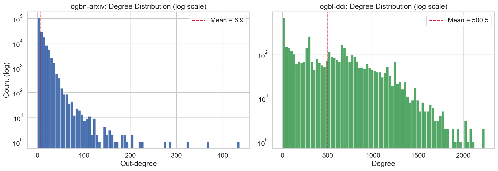
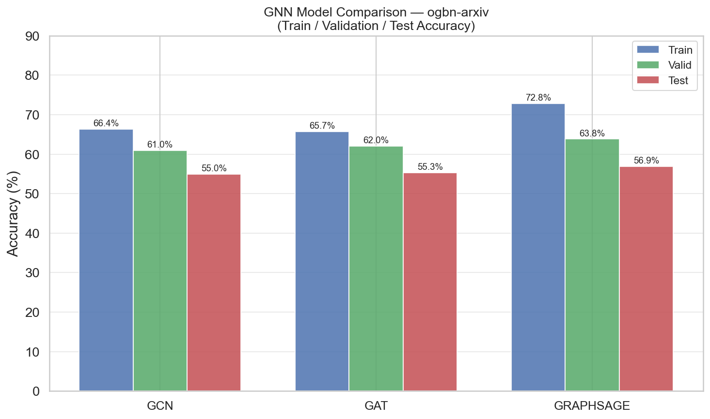
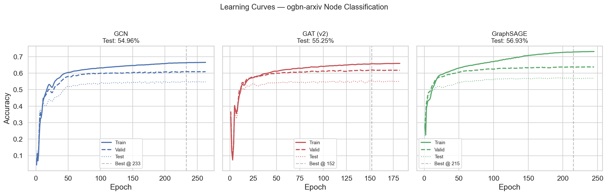
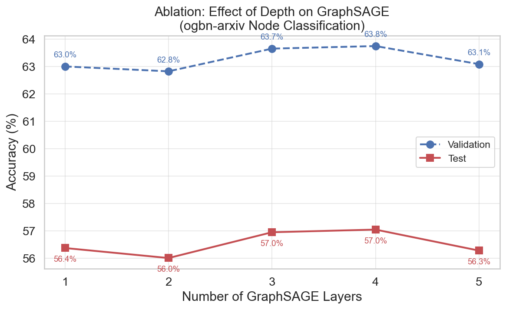

# Graph Machine Learning — Node Classification & Link Prediction

> PhD-level GNN project on large-scale OGB benchmarks.
> Implements GCN, GAT, and GraphSAGE for node classification
> and a GraphSAGE-based link predictor for drug-drug interaction prediction.

---

## Results

### Node Classification — ogbn-arxiv (169K nodes, 1.2M edges, 40 classes)

| Model | Test Accuracy | Val Accuracy | Parameters |
|---|---|---|---|
| GCN | 54.96% | 60.98% | 110K |
| GAT (v2) | 55.25% | 61.99% | 703K |
| **GraphSAGE** | **56.93%** | **63.82%** | **218K** |

GraphSAGE achieves the best accuracy with 3x fewer parameters than GAT.

### Depth Ablation — GraphSAGE on ogbn-arxiv

| Layers | Test Accuracy |
|---|---|
| 1 | 56.38% |
| 2 | 56.01% |
| 3 | 56.95% |
| **4** | **57.05%** |
| 5 | 56.28% |

Performance peaks at 4 layers then degrades — consistent with
**over-smoothing** in deep GNNs (Li et al., 2018).

### Link Prediction — ogbl-ddi (4K nodes, 2.1M edges)

| Model | Metric |
|---|---|
| DDIEncoder (GraphSAGE + MLP) | Hits@20 |

---

## Project Structure

```
graph-ml-gnn-analysis/
├── data/               # OGB datasets (auto-downloaded)
├── notebooks/          # EDA + experiments
├── src/
│   ├── data/           # Dataset loaders, preprocessing
│   ├── models/         # GCN, GAT, GraphSAGE, LinkPredictor
│   ├── training/       # Train loops, evaluator, early stopping
│   └── utils/          # Config, metrics, visualization
├── experiments/        # Checkpoints, logs, results
└── reports/figures/    # All generated plots
```

---

## Setup

```bash
git clone https://github.com/YOUR_USERNAME/graph-ml-gnn-analysis
cd graph-ml-gnn-analysis
python -m venv .venv
.venv\Scripts\activate       # Windows
pip install -r requirements.txt
```

---

## Run

```bash
# Verify models
python src/models/test_models.py

# Download datasets + sanity check
python src/data/load_data.py

# Train node classifier (GraphSAGE)
python src/training/train_node.py

# Train link predictor
python src/training/train_link.py

# Evaluate saved checkpoints
python src/training/evaluate.py
```

---

## Key Figures

| Degree Distribution | Model Comparison |
|---|---|
|  |  |

| Learning Curves | Depth Ablation |
|---|---|
|  |  |

---

## Technical Highlights

- **OGB benchmarks** — ogbn-arxiv (node classification) and ogbl-ddi
  (link prediction) — both used in NeurIPS/ICML leaderboards
- **3 GNN architectures** — GCN, GATv2, GraphSAGE with BatchNorm,
  residual connections, and dropout
- **Learnable node embeddings** for featureless DDI graph
- **Ablation study** — depth vs accuracy reveals over-smoothing at 5 layers
- **Early stopping + LR scheduling** — ReduceLROnPlateau with patience
- **Framework-agnostic** — PyG primary, DGL-compatible loaders

---

## References

- Kipf & Welling (2017) — Semi-Supervised Classification with GCNs
- Veličković et al. (2018) — Graph Attention Networks
- Hamilton et al. (2017) — Inductive Representation Learning (GraphSAGE)
- Brody et al. (2022) — How Attentive are Graph Attention Networks? (GATv2)
- Hu et al. (2020) — Open Graph Benchmark